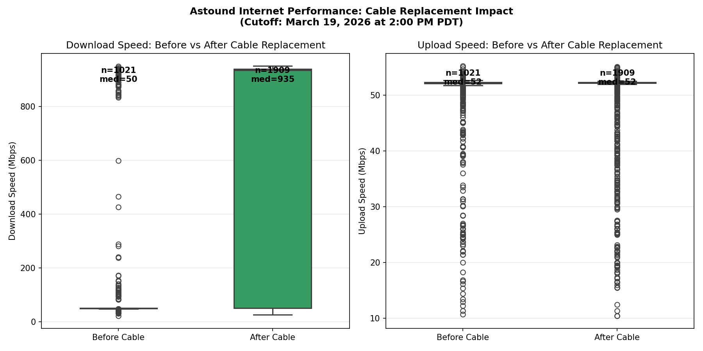
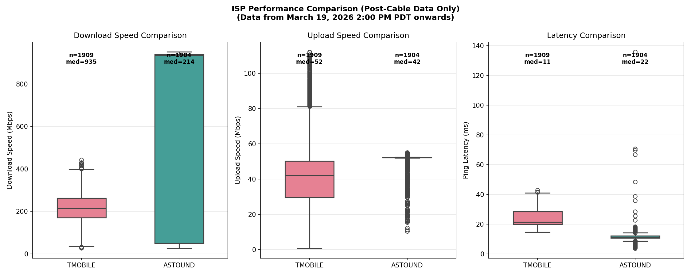
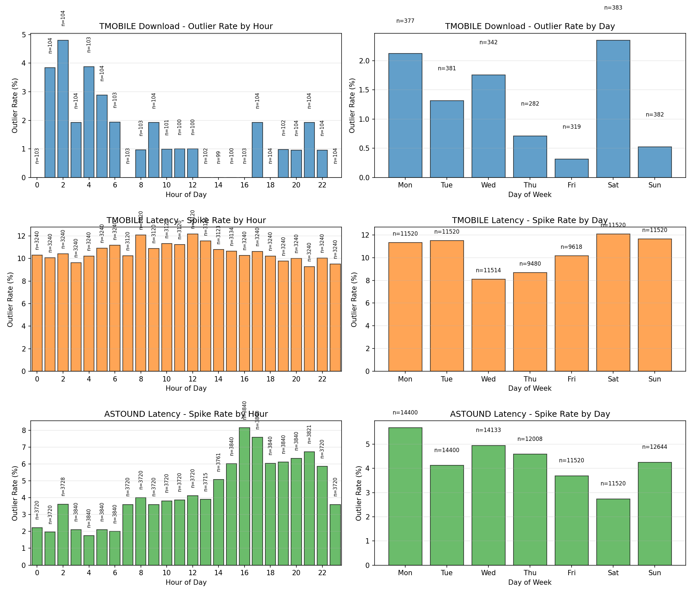

# Phase 1: ISP Performance Comparison Report

**Testing Period:** March 8 - April 8, 2026
**Purpose:** Evaluate Astound Broadband vs T-Mobile 5G Home Internet for streaming viability
**Status:** ✓ Complete

---

## Executive Summary

After a 31-day monitoring period comparing Astound Broadband (cable) and T-Mobile 5G Home Internet, **Astound is recommended as the primary ISP** for latency-sensitive applications like live streaming and video calls.

### Key Findings at a Glance

| Metric | Astound (Post-Cable Fix) | T-Mobile |
|--------|-------------------------|----------|
| Download Speed (median) | ~940 Mbps | ~225 Mbps |
| Upload Speed (median) | ~52 Mbps | ~45 Mbps |
| Latency (median) | ~12 ms | ~25 ms |
| Latency Stability | Stable | Variable (spikes to 300-900ms) |
| 4K Streaming Viable | 95%+ of time | 80-90% of time |

**Critical Event:** On March 19, 2026 at 2:00 PM PDT, a cable replacement by Astound resulted in a **~20x improvement** in download speeds (48 Mbps → 940 Mbps).

---

## Background

### Testing Methodology

- **Infrastructure:** Raspberry Pi 4 with dual Ethernet
  - eth0: Astound Broadband (cable)
  - eth1: T-Mobile 5G Home Internet (cellular gateway)
- **Speed Tests:** Ookla Speedtest CLI, interface-bound, every 15 minutes
- **Connectivity Monitoring:** DNS ping tests (8.8.8.8, 1.1.1.1) every minute

### Data Volume

| Data Type | Astound | T-Mobile |
|-----------|---------|----------|
| Speed Tests | 2,930 | 2,467 |
| Connectivity Checks | 90,628 | 76,694 |

---

## Key Findings

### 1. Download Speed Comparison

**Before Cable Fix (March 8-19):**
- Astound: ~48 Mbps average (severely throttled by faulty coax)
- T-Mobile: ~225 Mbps average

**After Cable Fix (March 19 onwards):**
- Astound: ~940 Mbps median (approaching gigabit)
- T-Mobile: ~225 Mbps (unchanged)

The cable replacement on March 19 was transformative. Pre-fix, T-Mobile was the clear winner for raw bandwidth. Post-fix, Astound delivers approximately **4x faster downloads**.

### 2. Upload Speed (Critical for Streaming)

For live streaming (webcam project), upload consistency matters more than raw speed.

| Quality Level | Requirement | Astound Viability | T-Mobile Viability |
|--------------|-------------|-------------------|-------------------|
| 720p | ≥3 Mbps | 99.9%+ | 99.9%+ |
| 1080p | ≥6 Mbps | 99.5%+ | 99%+ |
| 4K | ≥25 Mbps | 95%+ | 85-90% |

Both ISPs exceed requirements for 1080p streaming. For 4K streaming, Astound's more consistent ~52 Mbps upload provides better headroom than T-Mobile's more variable ~45 Mbps.

### 3. Latency Analysis

**Astound:**
- Median: ~12 ms
- Very stable, minimal variance
- Ideal for real-time applications

**T-Mobile:**
- Median: ~25 ms
- Significant variance with spikes to 300-900 ms
- Problematic for video calls and gaming

### 4. Outlier & Congestion Analysis

Using IQR-based outlier detection and chi-square testing, we identified time-clustered congestion patterns:

**Astound:**
- Peak congestion: Thursday/Monday, 2-5 PM
- Likely neighborhood cable node saturation
- Statistical significance: p < 0.05

**T-Mobile:**
- Peak congestion: Weekends (Saturday/Sunday)
- Consistent with cellular tower load patterns
- Statistical significance: p < 0.05

The key insight: these are **not random equipment failures** but predictable network congestion events. This helps plan around them.

---

## Streaming Viability Assessment

For the webcam streaming project requiring reliable upload:

### Recommendation: Use Astound

1. **Lower latency** (12ms vs 25ms) reduces stream delay
2. **More stable upload** (lower coefficient of variation)
3. **Post-cable fix performance** exceeds gigabit on downloads
4. **Predictable congestion windows** (weekday afternoons) can be worked around

### T-Mobile as Backup

T-Mobile provides a viable backup when:
- Astound has a complete outage
- Cable work is being performed in the neighborhood
- 225 Mbps download is sufficient for the task

---

## Conclusions

1. **Astound (post-cable fix) is the recommended primary ISP** for streaming applications
2. **Cable quality matters enormously** - the faulty coax was limiting Astound to ~5% of its potential
3. **T-Mobile provides solid redundancy** but has latency consistency issues for real-time streaming
4. **Both ISPs show time-clustered congestion** that can be planned around

---

## Appendix: Plot Gallery

### Speed Comparisons
- [Speed Comparison Timeline](../data/plots/phase1/speed_comparison.png)
- [Time of Day Analysis](../data/plots/phase1/time_of_day_comparison.png)
- [ISP Boxplot Comparison](../data/plots/phase1/astound_vs_tmobile_boxplot.png)
- [Before/After Cable Fix](../data/plots/phase1/astound_before_after_boxplot.png)

### Connectivity & Outliers
- [Connectivity Latency](../data/plots/phase1/connectivity_comparison.png)
- [Outlier Time Distribution](../data/plots/phase1/outlier_analysis.png)
- [Normalized Outlier Rates](../data/plots/phase1/normalized_outlier_rates.png)

---

*Report generated from data collected March 8 - April 8, 2026*
*Analysis performed using `analyze_isp.py`*
